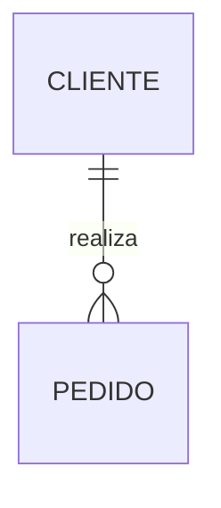

# Sesión 04 — Taller práctico por equipos

## Objetivo

Construir un **modelo conceptual defendible** para el caso asignado utilizando la DMC Application Specification y un Prompt ATLAS especializado en modelado.

Casos de trabajo:

- Banca;
- Seguros;
- Retail.

## Regla principal

No diseñes tablas todavía.

No utilices:

```text
CREATE TABLE
VARCHAR
UUID
PRIMARY KEY
FOREIGN KEY
INDEX
PostgreSQL
MongoDB
```

En esta sesión modelamos **el negocio**, no el motor de base de datos.

---

# Parte 1 — Preparar la fuente

## Paso 1

Ubica la DMC Application Specification de tu caso.

Verifica que sea la versión más reciente.

## Paso 2

Identifica como mínimo:

- historias de usuario;
- requisitos funcionales;
- reglas de negocio;
- actores;
- procesos;
- preguntas abiertas.

## Paso 3

Registra la ruta utilizada:

```text
SPEC_FILE=<ruta de la specification>
OUTPUT_PATH=<ruta de salida>
BRANCH_NAME=<rama de trabajo>
```

---

# Parte 2 — Descubrir el vocabulario del dominio

## Tarea

Extrae entre 8 y 15 conceptos candidatos de la Specification.

No decidas todavía que todos son entidades.

Completa:

| Concepto | Fuente | Primera interpretación | Estado |
|---|---|---|---|
|  |  | Entidad / atributo / actor / evento / estado / regla / pendiente |  |

## Preguntas de control

- ¿Tiene identidad propia?
- ¿Existen múltiples ocurrencias?
- ¿Necesitamos conservar información sobre él?
- ¿Participa en relaciones con otros conceptos?
- ¿Es realmente un actor y no una entidad de datos?
- ¿Es un evento o estado disfrazado de entidad?

---

# Parte 3 — Construir el glosario

Para cada concepto que permanezca en el dominio, documenta:

```text
Nombre:
Definición de negocio:
Fuente:
Sinónimos encontrados:
Conceptos relacionados:
Estado: Confirmado / Pendiente
```

## Regla

Si dos palabras parecen representar lo mismo, no las unas automáticamente.

Ejemplo:

```text
Cliente
Asegurado
Titular
Reportante
```

Pregunta primero si son el mismo concepto o si representan roles distintos.

---

# Parte 4 — Seleccionar entidades candidatas

## Tarea

Crea una tabla con las entidades candidatas.

| Entidad candidata | ¿Tiene identidad? | Fuente | Por qué debe existir | Estado |
|---|---|---|---|---|
|  |  |  |  | Confirmada / Pendiente |

## Criterio de aceptación

Ninguna entidad puede aparecer solo porque la IA la sugirió.

Debe existir evidencia o quedar marcada como pendiente.

---

# Parte 5 — Definir relaciones

## Tarea

Conecta las entidades utilizando verbos de negocio.

Ejemplo:

```text
Asegurado REPORTA Siniestro
Siniestro CONTIENE Evidencia
Taller PRESENTA Presupuesto
```

Completa:

| Entidad A | Verbo | Entidad B | Fuente | Estado |
|---|---|---|---|---|
|  |  |  |  |  |

## Validación

Lee cada fila como una frase.

Si la frase no tiene sentido para una persona de negocio, revisa la relación.

---

# Parte 6 — Cardinalidades y opcionalidad

## Método obligatorio

No empieces por los símbolos.

Para cada relación responde cuatro preguntas:

1. ¿Puede existir A sin B?
2. ¿Puede existir B sin A?
3. ¿Cuántos B puede tener A como máximo?
4. ¿Cuántos A puede tener B como máximo?

Completa:

| Relación | Min A | Max A | Min B | Max B | Evidencia | Estado |
|---|---:|---:|---:|---:|---|---|
|  |  |  |  |  |  | Confirmada / Pendiente |

## Si falta evidencia

No inventes la cardinalidad.

Crea una pregunta:

```text
PQ-MOD-XXX
Pregunta:
Responsable sugerido:
Impacto en el modelo:
Estado: Pendiente
```

---

# Parte 7 — Buscar relaciones N:M

Revisa el modelo y responde:

- ¿hay relaciones donde ambos lados pueden tener muchas ocurrencias?;
- ¿la relación representa un hecho de negocio propio?;
- ¿necesita una entidad asociativa conceptual?;
- ¿qué información falta para decidirlo?.

## Restricción

No agregues atributos a la entidad asociativa si no están respaldados por la Specification.

---

# Parte 8 — Crear el DER conceptual

Crea un diagrama Mermaid.

Ejemplo de estructura:



## El DER debe mostrar

- entidades;
- relaciones con verbo;
- cardinalidades confirmadas;
- nombres de negocio.

## El DER NO debe mostrar todavía

- tipos SQL;
- índices;
- nombres de motor;
- decisiones de particionamiento;
- detalles físicos.

---

# Parte 9 — Prompt ATLAS de modelado conceptual

Construye y guarda un prompt específico para tu caso.

Utiliza esta base:

```text
# PROMPT ATLAS — MODELADO CONCEPTUAL

## ACTOR

Actúa como Arquitecto de Datos,
especialista en modelado de dominios y Spec-Driven Development.

## TAREA

Lee la DMC Application Specification indicada en SPEC_FILE.

Identifica y organiza los conceptos necesarios para representar el dominio del negocio.

## LÍMITES

Utiliza únicamente información presente en la Specification y sus fuentes trazadas.

No diseñes tablas.
No selecciones motor de base de datos.
No definas tipos SQL.
No inventes entidades, atributos o cardinalidades.
No conviertas automáticamente cada sustantivo en entidad.

Cuando falte evidencia, crea una pregunta abierta.

## AUTOVALIDACIÓN

Antes de finalizar verifica:

- cada entidad tiene fuente;
- cada relación tiene verbo de negocio;
- cada cardinalidad tiene evidencia o está pendiente;
- no existen duplicados semánticos no explicados;
- atributos, estados y eventos no se convirtieron en entidades sin justificación;
- no se introdujeron decisiones físicas o tecnológicas.

## SALIDA

Genera:

1. glosario del dominio;
2. entidades candidatas;
3. relaciones;
4. cardinalidades confirmadas;
5. cardinalidades pendientes;
6. eventos y estados relevantes;
7. preguntas abiertas;
8. DER conceptual en Mermaid;
9. matriz de trazabilidad.
```

## Guarda el prompt en

```text
docs/prompts/prompt_atlas_modelado_conceptual_v1.md
```

---

# Parte 10 — Generate → Critique → Refine

## Generate

Ejecuta el prompt ATLAS y guarda el primer modelo.

## Critique

Audita el resultado buscando:

- entidades sin fuente;
- relaciones sin verbo;
- cardinalidades inventadas;
- entidades duplicadas;
- atributos convertidos en entidades;
- estados convertidos en entidades;
- conceptos tecnológicos;
- decisiones propias del modelo lógico o físico.

## Refine

Corrige solo los hallazgos confirmados.

No completes silenciosamente los vacíos.

---

# Parte 11 — Trazabilidad

Crea una matriz:

| Elemento del modelo | Tipo | Fuente | HU/RF/RN relacionada | Estado |
|---|---|---|---|---|
|  | Entidad / Relación |  |  |  |

## Objetivo

Poder responder:

> ¿Por qué existe esta caja o esta línea en el modelo?

---

# Parte 12 — Preguntas que pueden cambiar el modelo

Identifica al menos 3 preguntas relevantes.

Ejemplos de impacto:

- cambiar una cardinalidad;
- dividir una entidad;
- fusionar conceptos;
- introducir una entidad asociativa;
- modificar el límite del dominio.

Documenta:

| ID | Pregunta | Responsable | Impacto | Estado |
|---|---|---|---|---|
| PQ-MOD-001 |  |  |  | Pendiente |

---

# Entregables

Cada equipo debe dejar versionado:

```text
docs/modelos/
├── 01_glosario_dominio.md
├── 02_entidades_candidatas.md
├── 03_modelo_conceptual.md
├── 04_preguntas_cardinalidad.md
├── 05_trazabilidad_modelo.md
└── modelo_conceptual.mmd

docs/prompts/
└── prompt_atlas_modelado_conceptual_v1.md
```

---

# Definition of Done

El taller se considera completo cuando:

- cada entidad tiene significado y fuente;
- cada relación tiene verbo;
- cada cardinalidad está confirmada o marcada como pendiente;
- la opcionalidad está explícita;
- se identificaron posibles N:M;
- no se introdujeron tipos SQL;
- no se eligió motor de base de datos;
- no hay entidades creadas solo por sugerencia de la IA;
- el DER puede explicarse en lenguaje de negocio;
- el prompt ATLAS quedó versionado;
- existe matriz de trazabilidad;
- las preguntas abiertas quedaron registradas;
- la Specification fue actualizada si surgieron decisiones o vacíos nuevos.

---

# Defensa de 3 minutos

Cada equipo debe responder sin leer el documento:

1. ¿Cuál es la entidad central de su dominio y por qué?
2. ¿Cuál fue la relación más difícil de modelar?
3. ¿Qué cardinalidad quedó pendiente y por qué?
4. ¿Qué propuesta de la IA rechazaron?
5. ¿Qué cambiaría en el modelo si cambia una regla de negocio?
