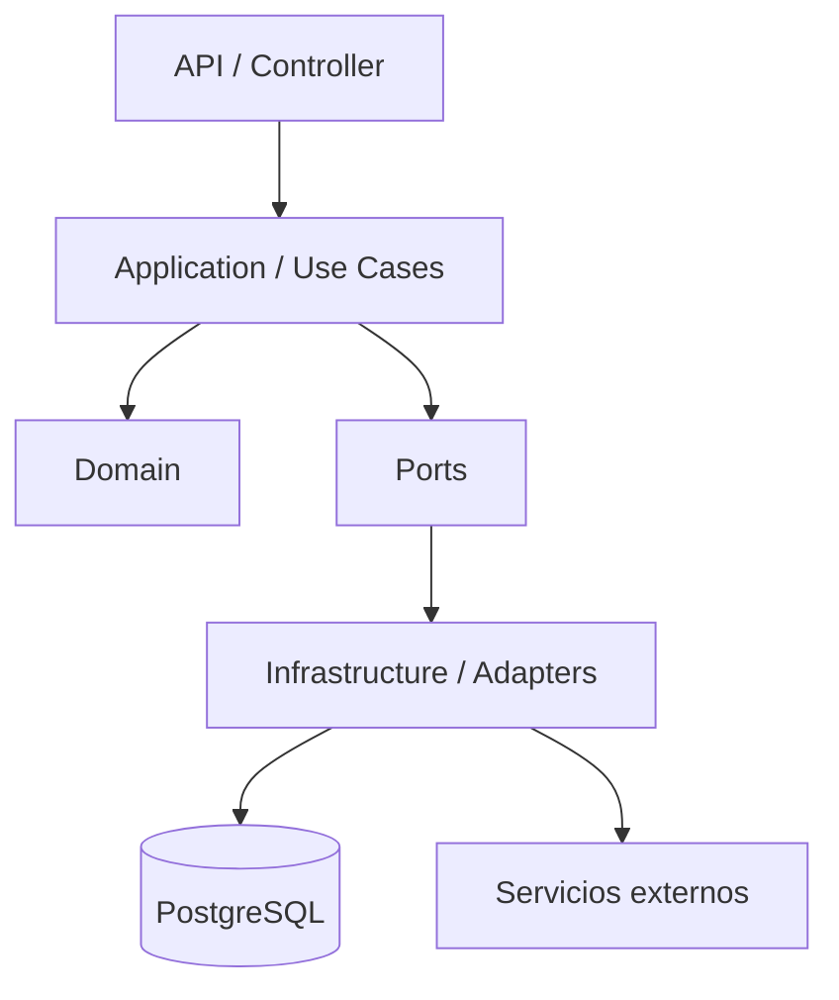
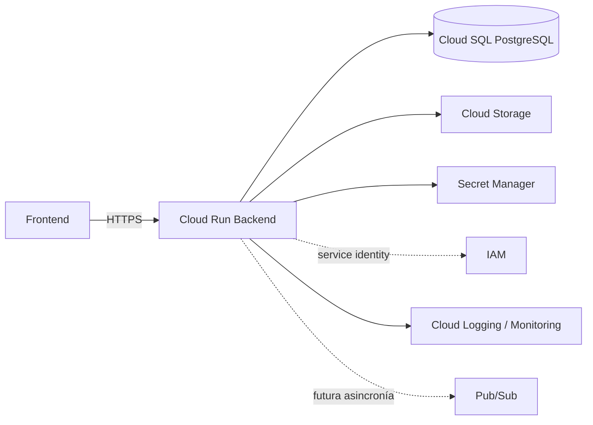

# Sesión 07 — Plan docente de 3 horas

## Título

**Del código a una arquitectura de software profesional en Google Cloud**

## Resultado de aprendizaje

Al finalizar la sesión, el participante podrá revisar un backend generado con asistencia de IA, identificar sus drivers arquitectónicos, reorganizarlo bajo una separación clara de responsabilidades y justificar una arquitectura GCP trazable a requisitos y atributos de calidad.

## Caso conductor

**Siniestro Fácil**.

Se trabaja sobre el backend iniciado en la Sesión 06. No se desarrolla un backend nuevo desde cero: se audita y refactoriza el incremento existente.

---

# Agenda detallada

## 0–15 min — Apertura: generar rápido no es diseñar bien

### Objetivo

Hacer visible el cambio de etapa del curso.

### Pregunta de apertura

> Si ATLAS puede generar un endpoint funcional en minutos, ¿qué debería ocupar ahora el tiempo de un arquitecto o desarrollador senior?

### Mostrar

```text
Antes
Requirement → Code

Ahora
Requirement
   ↓
Architecture Decision
   ↓
Code
   ↓
Break
   ↓
Measure
   ↓
Refine
```

### Discusión

Pedir al grupo que identifique en el backend actual:

- decisiones que la IA tomó implícitamente;
- elementos acoplados al framework;
- responsabilidades mezcladas;
- dependencias de infraestructura;
- preguntas todavía no resueltas.

### Evidencia

Lista inicial de 5–10 riesgos arquitectónicos.

---

## 15–35 min — De requisitos no funcionales a architecture drivers

### Objetivo

Enseñar que la arquitectura no se diseña desde un catálogo de servicios cloud, sino desde necesidades y restricciones.

### Drivers a revisar en Siniestro Fácil

- disponibilidad;
- rendimiento;
- seguridad;
- privacidad;
- evidencia y trazabilidad;
- resiliencia;
- escalabilidad;
- observabilidad;
- idempotencia;
- auditabilidad.

### Ejercicio guiado

Completar:

| Fuente | Driver | Riesgo si se ignora | Decisión que obliga a considerar |
|---|---|---|---|
| RNF | escalabilidad | saturación | stateless + autoscaling + límites DB |
| RF | evidencia | pérdida/corrupción | almacenamiento especializado + metadata |
| RF/RN | idempotencia | siniestros duplicados | key/idempotency strategy |
| RNF | observabilidad | fallos invisibles | logging estructurado + correlation ID |

### Regla

> No se permite agregar un componente GCP sin explicar qué driver, requisito o riesgo resuelve.

---

## 35–60 min — Arquitectura interna del backend

### Objetivo

Separar responsabilidades antes de hablar de infraestructura.

### Modelo didáctico



### Conceptos

- controller;
- use case / application service;
- dominio;
- puertos;
- adaptadores;
- repositorio;
- dependency inversion;
- cohesión y acoplamiento.

### Anti-patrones a mostrar

1. SQL directamente en el controller.
2. Regla de negocio en DTO/request validator.
3. Código de Google Cloud dentro de entidades de dominio.
4. Singleton/memoria local como estado persistente.
5. Secrets hardcoded.

### Mini challenge

Mostrar una pieza de código del backend y pedir:

> ¿Qué responsabilidad debería moverse y hacia dónde?

---

## 60–80 min — Modular Monolith vs Microservices

### Objetivo

Evitar la asociación automática “cloud = microservicios”.

### Comparación

| Criterio | Modular Monolith | Microservices |
|---|---|---|
| Complejidad operativa | menor | mayor |
| Transacciones | simples | distribuidas / eventual consistency |
| Despliegue | conjunto | independiente |
| Observabilidad | más simple | crítica |
| Autonomía de equipos | moderada | alta |
| Escalado independiente | limitado | fuerte |
| Adecuado para MVP | frecuentemente | solo con drivers claros |

### Decisión del curso

Siniestro Fácil inicia como **Modular Monolith** con límites internos explícitos.

### ADR sugerido

`ADR-002-modular-monolith-before-microservices.md`

---

## 80–105 min — Arquitectura GCP de referencia

### Objetivo

Mapear responsabilidades del software a servicios gestionados.

### Diagrama



### Componente por componente

#### Cloud Run

- servicio HTTP administrado;
- backend stateless;
- múltiples instancias;
- autoscaling;
- concurrencia;
- revisión desplegable.

#### Cloud SQL PostgreSQL

- persistencia transaccional;
- migraciones;
- restricciones;
- pool de conexiones;
- presión causada por escalamiento de aplicación.

#### Cloud Storage

- archivos de evidencia;
- PostgreSQL conserva metadata, hash, referencias y estado.

#### IAM + Service Account

- identidad del workload;
- mínimo privilegio;
- no claves embebidas.

#### Secret Manager

- secretos fuera del código;
- configuración por ambiente.

#### Logging / Monitoring

- evidencia de ejecución;
- diagnóstico;
- base para SLA/SLO.

### Nota docente

Pub/Sub se presenta como vista previa arquitectónica; se profundiza en la Sesión 14.

---

## 105–125 min — Cloud Run: stateless, concurrency y presión sobre Cloud SQL

### Objetivo

Introducir un problema real de arquitectura cloud.

### Escenario

```text
20 instancias Cloud Run
×
10 conexiones por instancia
=
200 conexiones potenciales
```

### Preguntas

- ¿la base soporta el crecimiento de conexiones?
- ¿qué tamaño de pool debe tener la aplicación?
- ¿qué pasa si Cloud Run escala más rápido que PostgreSQL?
- ¿deberíamos limitar max instances?
- ¿qué requests pueden ejecutarse concurrentemente?

### Conceptos

- connection pool;
- max instances;
- concurrency;
- timeout;
- transaction duration;
- stateless processing.

### Referencia

Cloud Run ejecuta múltiples solicitudes concurrentes por instancia según configuración y exige que la aplicación pueda manejar esa concurrencia correctamente.

---

## 125–140 min — Seguridad y configuración desde arquitectura

### Objetivo

Eliminar anti-patrones antes de desplegar.

### Comparar

```text
MAL
DB_PASSWORD en repositorio
service-account-key.json en aplicación
permisos Owner
```

con:

```text
Cloud Run
  ↓ Service Account
IAM
  ↓
Secret Manager / Cloud SQL / Storage
```

### Checklist rápido

- ninguna clave en Git;
- identidad por workload;
- mínimo privilegio;
- secretos externos;
- configuración por ambiente;
- acceso de infraestructura aislado del dominio.

---

## 140–155 min — Observabilidad como requisito de diseño

### Objetivo

Mostrar que los logs se diseñan antes de producción.

### Contexto sugerido

```json
{
  "request_id": "...",
  "claim_id": "...",
  "operation": "register_claim",
  "latency_ms": 0,
  "status": "...",
  "error_code": "..."
}
```

### Preguntas

- ¿cómo seguimos un siniestro entre capas?
- ¿cómo encontramos todas las operaciones de un request?
- ¿qué jamás debe aparecer en logs?
- ¿qué métrica demuestra el RNF de latencia?

### Salida

Estándar mínimo de logging y correlación.

---

## 155–170 min — ATLAS Architecture Review

### Objetivo

Usar IA como revisor y no únicamente como generador.

### Secuencia

```text
Backend actual
    ↓
ATLAS Architecture Review
    ↓
Hallazgos
    ↓
Trazabilidad
    ↓
Refactor propuesto
    ↓
Revisión humana
```

### Clasificación

- CRITICAL;
- HIGH;
- MEDIUM;
- LOW.

### Hallazgos que debe buscar

- dependencia invertida incorrectamente;
- SQL en capa HTTP;
- dominio acoplado a framework/GCP;
- secretos/configuración;
- estado local persistente;
- falta de timeout;
- falta de idempotencia;
- problemas de transacción;
- ausencia de observabilidad;
- componente GCP sin driver.

---

## 170–180 min — Evidencia, ADR y cierre

### Entregables mínimos

```text
docs/arquitectura/
├── architecture_drivers.md
├── software_architecture_v1.md
├── gcp_architecture_v1.md
├── architecture_guidelines.md
└── adr/
    ├── ADR-001-cloud-run.md
    ├── ADR-002-modular-monolith.md
    └── ADR-003-evidence-storage.md

docs/prompts/
└── atlas_architecture_review.md

evidence/
└── session_07/
    └── architecture_review.md
```

### Cierre

El equipo responde:

1. ¿Qué cambió en el backend por una decisión arquitectónica?
2. ¿Qué RNF justifica cada decisión principal?
3. ¿Qué componente evitamos agregar porque no estaba justificado?
4. ¿Qué refactor queda bloqueando el siguiente incremento?

## Definition of Done de la clase

- architecture drivers trazados;
- arquitectura interna definida;
- arquitectura GCP v1 definida;
- mínimo 3 ADR;
- revisión ATLAS ejecutada;
- hallazgos priorizados;
- backlog de refactor actualizado;
- ningún componente cloud crítico sin justificación;
- Specification actualizada cuando corresponda.
