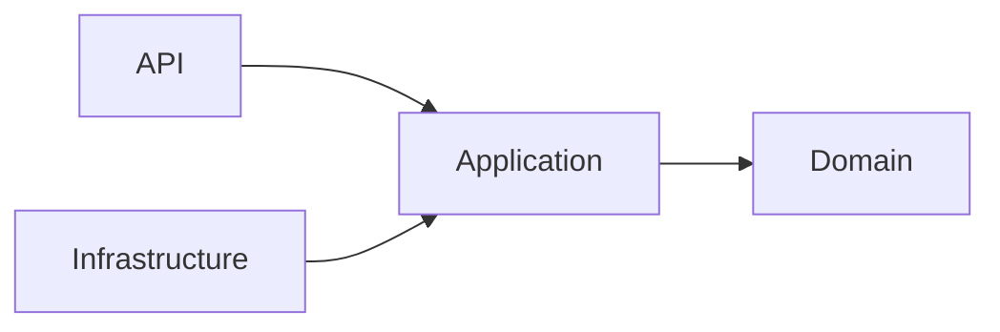

# Lineamientos de arquitectura de software y Google Cloud

## 1. Principio general

La arquitectura se deriva de la Specification y de sus atributos de calidad. No se seleccionan servicios cloud por moda ni por conveniencia del generador de código.

Cadena obligatoria:

```text
Requisito / RNF
      ↓
Driver arquitectónico
      ↓
Decisión
      ↓
Responsabilidad
      ↓
Componente
      ↓
Riesgo
      ↓
Prueba / evidencia
```

## 2. Arquitectura interna objetivo

### Capas lógicas

#### API / Interface

Responsabilidades:

- HTTP;
- serialización;
- validación sintáctica;
- autenticación/autorización delegada cuando aplique;
- traducción de errores a contrato API.

No contiene:

- SQL;
- reglas de negocio complejas;
- decisiones de infraestructura;
- lógica de persistencia.

#### Application

Responsabilidades:

- casos de uso;
- orquestación;
- límites transaccionales;
- coordinación de puertos;
- decisiones de flujo sustentadas por reglas.

#### Domain

Responsabilidades:

- conceptos del negocio;
- invariantes;
- estados y transiciones;
- reglas puras cuando sea posible.

No depende de:

- framework web;
- Google Cloud;
- ORM;
- PostgreSQL.

#### Infrastructure

Responsabilidades:

- repositorios PostgreSQL;
- adaptadores Cloud Storage;
- Secret Manager/configuración;
- clientes externos;
- mensajería;
- observabilidad técnica.

## 3. Regla de dependencias

Las dependencias apuntan hacia el núcleo de negocio.



El dominio no importa módulos de infraestructura.

## 4. Modular Monolith como baseline

Para el MVP de Siniestro Fácil se prefiere un monolito modular antes que microservicios.

### Motivos

- menor complejidad operativa;
- transacciones simples;
- un equipo de curso;
- dominio todavía evolucionando;
- más fácil trazabilidad end-to-end;
- menor costo cognitivo.

### Condiciones que podrían justificar separación futura

- necesidad de escalamiento independiente;
- autonomía real de equipos;
- ciclo de release independiente;
- aislamiento de fallos;
- límites de dominio estables;
- necesidades tecnológicas incompatibles;
- cumplimiento o seguridad que requiera aislamiento.

## 5. Cloud Run

### Lineamientos

- proceso stateless;
- no confiar en disco local como almacenamiento persistente;
- soportar múltiples instancias;
- soportar concurrencia de requests de acuerdo con configuración;
- escuchar el puerto indicado por `PORT`;
- externalizar configuración;
- configurar timeouts explícitos;
- dimensionar min/max instances conscientemente;
- no asumir afinidad de sesión.

### Preguntas de revisión

- ¿qué pasa si una instancia desaparece después del request?
- ¿qué estado se perdería?
- ¿el código usa variables globales mutables?
- ¿es thread/concurrency safe?
- ¿puede arrancar una nueva instancia sin pasos manuales?

## 6. Cloud SQL PostgreSQL

### Lineamientos

- migraciones versionadas;
- constraints como defensa de invariantes;
- connection pool limitado;
- transacciones cortas;
- evitar mantener conexiones innecesarias;
- observar el impacto del autoscaling de Cloud Run sobre el total de conexiones;
- no ocultar retries que puedan duplicar operaciones no idempotentes.

### Fórmula de razonamiento

```text
conexiones potenciales
≈
instancias máximas de aplicación
×
pool máximo por instancia
```

No es una fórmula de capacidad definitiva; es una alerta de arquitectura para no diseñar aplicación y base de datos de manera aislada.

## 7. Cloud Storage para evidencias

Los archivos de evidencia se almacenan fuera de PostgreSQL salvo decisión contraria justificada.

PostgreSQL conserva, cuando esté definido por el modelo:

- identificador;
- referencia/URI;
- hash;
- versión;
- metadata necesaria;
- relación con el siniestro;
- estado de procesamiento;
- trazabilidad.

### Riesgos a analizar

- archivos huérfanos;
- upload incompleto;
- reemplazos;
- integridad hash;
- malware;
- acceso indebido;
- borrado accidental;
- consistencia entre objeto y metadata.

## 8. IAM y Service Accounts

- cada workload utiliza identidad de servicio;
- mínimo privilegio;
- evitar claves de service account distribuidas;
- separar permisos de ejecución y administración;
- documentar qué servicio accede a qué recurso y por qué.

## 9. Secret Manager

Nunca versionar:

- passwords;
- tokens;
- claves privadas;
- connection strings con secretos;
- archivos de credenciales.

La aplicación recibe configuración y secretos desde mecanismos externos al código.

## 10. Observabilidad mínima

Todo request o comando crítico debe permitir reconstruir:

- qué operación se ejecutó;
- para qué entidad de negocio;
- cuándo;
- resultado;
- duración;
- error normalizado;
- identificador de correlación.

### No loggear

- passwords;
- tokens;
- secretos;
- documentos sensibles completos;
- PII innecesaria.

## 11. Integraciones

Cada integración debe declarar:

- timeout;
- comportamiento ante fallo;
- si admite retry;
- si la operación es idempotente;
- mapping de errores;
- observabilidad;
- dependencia síncrona o asíncrona.

Pub/Sub y Eventarc se profundizan en una sesión posterior.

## 12. ADR obligatorios iniciales

### ADR-001 — Cloud Run como runtime del backend

Debe documentar por qué el workload es apto para ejecución stateless y qué restricciones genera.

### ADR-002 — Modular Monolith antes de microservicios

Debe explicitar por qué la complejidad distribuida no está justificada todavía.

### ADR-003 — Evidencias en Cloud Storage y metadata en PostgreSQL

Debe explicar responsabilidades, consistencia y trazabilidad.

## 13. Architecture fitness questions

Antes de aceptar el incremento:

1. ¿El dominio puede ejecutarse sin conocer GCP?
2. ¿Puedo cambiar PostgreSQL adapter sin modificar controller y dominio?
3. ¿Puedo reemplazar Storage adapter sin cambiar el caso de uso?
4. ¿Una instancia de Cloud Run puede morir sin perder estado de negocio confirmado?
5. ¿El autoscaling puede agotar conexiones de Cloud SQL?
6. ¿Los secretos están fuera del repositorio?
7. ¿Puedo trazar un request crítico de extremo a extremo?
8. ¿Cada componente cloud tiene un driver documentado?
9. ¿Existe una prueba o evidencia para la decisión crítica?
10. ¿La IA introdujo una dependencia no autorizada?

## 14. Referencias oficiales

- Google Cloud Well-Architected Framework: https://docs.cloud.google.com/docs/get-started/well-architected-framework
- Cloud Run development requirements: https://docs.cloud.google.com/run/docs/developing
- Cloud Run container contract: https://docs.cloud.google.com/run/docs/container-contract
- Cloud Run concurrency: https://docs.cloud.google.com/run/docs/about-concurrency
- Cloud SQL PostgreSQL from Cloud Run: https://docs.cloud.google.com/sql/docs/postgres/connect-run
