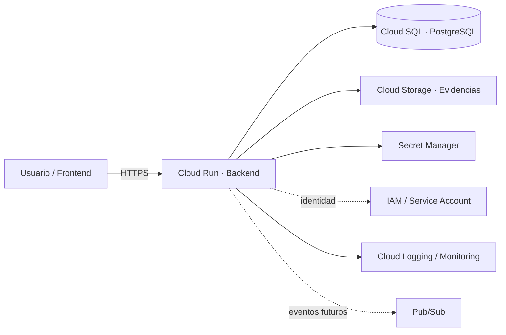

# Sesión 07 — Arquitectura de software cloud-native en Google Cloud

## Propósito

Establecer los lineamientos de arquitectura que gobernarán el backend iniciado en la Sesión 06, antes de continuar generando más código con IA.

La sesión enseña a transformar requisitos funcionales y no funcionales de **Siniestro Fácil** en decisiones explícitas de arquitectura de software y componentes Google Cloud.

## Pregunta central

> ¿Cómo evitamos que la IA genere simplemente código que funciona y hacemos que genere software que pueda desplegarse, escalar, observarse, protegerse y evolucionar profesionalmente?

## Idea fuerza

```text
SDD
 ↓
RNF
 ↓
Decisiones de arquitectura
 ↓
Estructura de software
 ↓
Componentes GCP
 ↓
Código
 ↓
Pruebas y evidencia
```

El backend no debe crecer antes de definir las reglas que ordenan sus dependencias, sus responsabilidades y su futura operación.

## Caso conductor — Siniestro Fácil

Se utiliza el backend iniciado en la Sesión 06 y se evalúa contra drivers existentes del caso:

- registro idempotente de siniestros;
- evidencias digitales;
- trazabilidad y auditoría;
- seguridad y segregación;
- resiliencia ante integraciones;
- escalabilidad ante picos;
- observabilidad;
- tiempos de respuesta medibles.

## Decisión pedagógica base

Para el MVP del curso se utiliza como punto de partida:

> **Modular Monolith + separación limpia/hexagonal + servicios administrados de Google Cloud.**

No se introducen microservicios por defecto. Una separación adicional debe justificarse por dominio, escalabilidad, autonomía de despliegue, aislamiento operativo o requisito explícito.

## Arquitectura de referencia v1



La arquitectura es una referencia inicial, no una licencia para agregar componentes sin trazabilidad.

## Lineamientos DMC de arquitectura

1. El dominio no depende de HTTP, PostgreSQL ni Google Cloud.
2. El controller no contiene reglas de negocio.
3. Los casos de uso orquestan comportamiento y límites transaccionales.
4. Persistencia e integraciones se consumen mediante puertos/adaptadores.
5. El backend destinado a Cloud Run no depende de estado local persistente.
6. Secretos y credenciales no viven en código ni repositorio.
7. Cada workload utiliza identidad y mínimo privilegio.
8. Toda integración externa debe tener timeout, error explícito y estrategia de degradación/reintento cuando corresponda.
9. Todo request crítico debe ser trazable mediante logs estructurados e identificadores de correlación.
10. Toda decisión arquitectónica relevante se registra como ADR y se vincula con la Specification.
11. Ningún servicio GCP se agrega porque “es buena práctica”; debe resolver un requisito, riesgo o atributo de calidad.
12. El código generado por IA se acepta por evidencia, no por apariencia.

## Movimientos de la sesión

1. **Revisar el backend iniciado** — detectar decisiones implícitas y deuda temprana.
2. **Extraer drivers arquitectónicos** — RF, RNF, reglas y riesgos.
3. **Definir arquitectura interna** — API, aplicación, dominio, puertos e infraestructura.
4. **Mapear arquitectura a GCP** — Cloud Run, Cloud SQL, Cloud Storage, IAM, Secret Manager y observabilidad.
5. **Registrar ADR** — contexto, decisión, alternativas y consecuencias.
6. **Ejecutar ATLAS Architecture Review** — critique y refactor propuesto.
7. **Actualizar backlog y Specification** — cambios requeridos antes de continuar construcción.

## Incremento observable

Al finalizar la sesión el equipo debe producir:

- `architecture_drivers.md`;
- `software_architecture_v1.md`;
- diagrama Mermaid de arquitectura lógica;
- diagrama Mermaid de arquitectura GCP;
- `architecture_guidelines.md`;
- mínimo tres ADR;
- `atlas_architecture_review.md`;
- backlog de refactor arquitectónico priorizado;
- actualización de preguntas/decisiones de la Specification.

## Frontera con la Sesión 08

La Sesión 07 define **cómo se organiza y despliega conceptualmente el software**.

La Sesión 08 toma esa arquitectura y profundiza **qué invariantes debe proteger**, dónde viven las reglas, cómo se delimitan transacciones y qué ocurre ante concurrencia y fallos parciales.

## Archivos de la sesión

1. `README.md` — propósito y marco general.
2. `01_plan_docente_3_horas.md` — guion detallado de clase.
3. `02_lineamientos_arquitectura_software_gcp.md` — reglas y arquitectura de referencia.
4. `03_prompts_atlas_architecture_review.md` — prompts de diseño, crítica y revisión.
5. `04_taller_siniestro_facil_arquitectura.md` — laboratorio guiado.
6. `05_adr_y_definition_of_done.md` — ADR mínimos y criterios de cierre.

## Referencias oficiales Google Cloud

- Google Cloud Well-Architected Framework: https://docs.cloud.google.com/docs/get-started/well-architected-framework
- Cloud Run — Developing your service: https://docs.cloud.google.com/run/docs/developing
- Cloud Run — Container runtime contract: https://docs.cloud.google.com/run/docs/container-contract
- Cloud Run — Concurrency: https://docs.cloud.google.com/run/docs/about-concurrency
- Cloud SQL for PostgreSQL — Connect from Cloud Run: https://docs.cloud.google.com/sql/docs/postgres/connect-run

## Mensaje central

> La IA puede generar una aplicación rápidamente. La arquitectura define si esa aplicación puede evolucionar sin convertirse rápidamente en deuda técnica.
