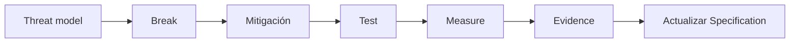

# DMC Institute — Sesión 15

## Arquitectura segura de bases de datos

**Duración:** 3 horas  
**Modalidad:** teórico-práctica  
**Programa:** Arquitectura y Bases de Datos con IA para Aplicaciones Modernas  
**Metodología:** Spec-Driven Development + framework ATLAS

## Pregunta guía

> La base funciona y ya está desplegada. ¿Cómo evitamos que sea el punto más débil de la aplicación?

## Propósito

Introducir la seguridad de bases de datos desde una mirada de arquitectura: amenazas, superficie de ataque, mínimo privilegio, protección de secretos, prevención de inyección, trazabilidad, backups y replicación. La sesión conecta el despliegue multi-nube con la necesidad de proteger datos, identidades y operaciones antes de pasar al hardening técnico profundo.

## Contenido oficial

- Principales vulnerabilidades en bases de datos y técnicas de detección y mitigación.
- SQL Injection.
- NoSQL Injection.
- Exfiltración de datos.
- Privilege escalation.
- Secrets exposure.
- Taller: explotación y mitigación de SQL Injection en ambiente controlado.
- Taller: usuarios, roles y permisos en PostgreSQL.
- Taller: diseño de backups protegidos/inmutables.
- Taller: replicación básica y diferencia entre réplica y backup.

## Laboratorio guiado

La sesión incorpora un laboratorio reproducible en Google Cloud Shell:

```text
laboratorio/
├── README.md
├── seed.sql
├── app_inseguro.py
├── app_seguro.py
├── roles.sql
├── permissions_test.sh
├── requirements.txt
└── tests/
    └── test_sqli.py
```

El laboratorio sigue el ciclo:



Incluye:

1. threat modeling asistido por IA;
2. reproducción controlada y mitigación de SQL Injection;
3. validación estructural como principio contra inyección NoSQL;
4. mínimo privilegio y pruebas automatizadas de permisos;
5. análisis de secrets exposure y blast radius de exfiltración;
6. backup lógico, checksum y restauración verificable;
7. replicación lógica para demostrar que **réplica ≠ backup**;
8. diagramas Mermaid versionables y evidencias SDD.

Ver [`laboratorio/README.md`](./laboratorio/README.md) para el paso a paso completo.

## Resultado observable

Cada equipo termina con:

- threat model básico de la solución;
- matriz de vulnerabilidades y controles;
- SQL Injection reproducido y mitigado en laboratorio;
- test de regresión;
- matriz de roles y permisos;
- estrategia de secretos y exfiltración;
- estrategia de backup con restore probado;
- estrategia de replicación;
- evidencias before/after;
- actualización de la DMC Application Specification.

## Principio de trabajo con IA

> **La IA propone. La configuración controla. La prueba demuestra. La evidencia decide.**

## Idea fuerza

> Una base de datos no es segura porque tenga contraseña. Es segura cuando un error, un atacante o una credencial comprometida no pueden llevarse todo.

## Conexión con la Sesión 16

La Sesión 15 responde **qué debemos proteger y por qué**. La Sesión 16 llevará esos principios a configuraciones concretas de hardening sobre PostgreSQL y Linux.
