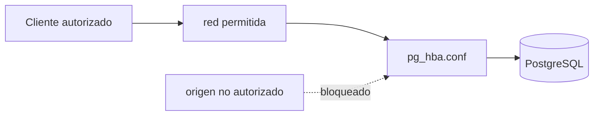
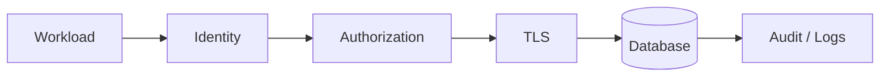

# DMC Institute — Sesión 16

## Plan docente de 3 horas — Hardening y protección de bases de datos

## Objetivos de aprendizaje

Al finalizar, el participante podrá:

1. mapear Confidentiality, Integrity y Availability a controles concretos;
2. construir un baseline de seguridad PostgreSQL/Linux;
3. reducir superficie de ataque en puertos, listeners, usuarios y extensiones;
4. revisar `pg_hba.conf`, ownership e inheritance;
5. diferenciar cifrado at-rest e in-transit;
6. habilitar y verificar TLS;
7. consumir secretos mediante un gestor de secretos;
8. configurar logging y auditoría básica;
9. demostrar hardening mediante evidencia before/after;
10. actualizar el Spec con controles verificables.

## Pregunta guía

> ¿Cómo sabemos que PostgreSQL está realmente endurecido y no solo “configurado”?

## Agenda

| Tiempo | Bloque | Resultado |
|---:|---|---|
| 0–15 | Puente S15 → S16 + CIA | mapa CIA |
| 15–35 | Baseline y superficie de ataque | hardening_before |
| 35–55 | Red, listeners y pg_hba.conf | acceso reducido |
| 55–75 | Roles, ownership, extensiones | inventario y correcciones |
| 75–90 | Cifrado + Zero Trust | diseño de controles |
| 90–100 | Pausa | — |
| 100–125 | Taller 1: hardening PostgreSQL/Linux | before/after |
| 125–145 | Taller 2: TLS | sesión cifrada validada |
| 145–165 | Taller 3: Secret Manager | secreto fuera del repo |
| 165–175 | Taller 4: auditoría y logs | actividad observable |
| 175–180 | Reviewer + cierre | evidence index + Spec |

## 1. CIA aplicado a Pedidos

| Dimensión | Pregunta | Controles |
|---|---|---|
| Confidentiality | ¿quién puede leer qué? | roles, TLS, secrets, red |
| Integrity | ¿quién puede modificar qué? | ownership, permisos, auditoría |
| Availability | ¿cómo seguimos o recuperamos? | backup, replica, operación |

## 2. Baseline de hardening

Registrar antes de modificar:

```bash
ss -lntp
```

```sql
SHOW listen_addresses;
SHOW port;
SHOW ssl;
SHOW password_encryption;

SELECT rolname, rolsuper, rolcreaterole, rolcreatedb
FROM pg_roles;

SELECT extname, extversion
FROM pg_extension;
```

Toda evidencia debe incluir:

```text
timestamp
commit SHA
comando
resultado
PASS / FAIL
```

## 3. Red, listeners y pg_hba.conf

Modelo:



Explicar:

```text
quién → desde dónde → a qué base → con qué método
```

Ejemplo conceptual:

```text
hostssl pedidos app_runtime 10.0.0.0/24 scram-sha-256
```

## 4. Roles, ownership e inheritance

La aplicación:

- no es superuser;
- no es owner;
- no crea roles;
- no reparte permisos;
- recibe solo el mínimo necesario.

Revisar además privilegios heredados.

## 5. Extensiones

```sql
SELECT extname, extversion
FROM pg_extension;
```

Clasificar:

- aprobada y necesaria;
- necesaria pendiente de validación;
- innecesaria;
- desconocida.

## 6. Cifrado

### At-rest

Aplicado a:

- discos;
- snapshots;
- backups;
- object storage.

### In-transit

TLS entre cliente y PostgreSQL.

Validación obligatoria:

```sql
SELECT ssl, version, cipher
FROM pg_stat_ssl
WHERE pid = pg_backend_pid();
```

`ssl = on` por sí solo no es evidencia suficiente.

## 7. Zero Trust



No confiar solo porque el tráfico venga desde “la red interna”.

## 8. Secret Manager

Patrón:

```text
Código sin secreto
→ identidad
→ Secret Manager
→ secreto en runtime
→ PostgreSQL
```

En GCP el laboratorio puede utilizar Secret Manager. El aprendizaje es el patrón, no memorizar el producto.

## 9. Auditoría y logs

Preguntas mínimas:

- ¿quién se conectó?
- ¿desde qué origen?
- ¿cuándo?
- ¿con qué aplicación?
- ¿qué error ocurrió?
- ¿qué control lo bloqueó?

Consulta base:

```sql
SELECT usename, application_name, client_addr, backend_start
FROM pg_stat_activity;
```

`pgAudit` se presenta como capacidad avanzada, no como requisito universal.

## 10. Laboratorio

Usar:

```text
GPT / Claude → GitHub → Cloud Shell → PostgreSQL
                         ↓
                    Checkpoint
                         ↓
                    Evidence
                         ↓
                      GitHub
                         ↓
                 Gemini reviewer
```

Ver [laboratorio/README.md](./laboratorio/README.md).

## Prompt ATLAS

```text
## ACTOR
Security Architect y PostgreSQL Security Engineer.

## TAREA
Evalúa el entorno PostgreSQL del laboratorio y aplica hardening verificable.

## LÍMITES
No inventes evidencia.
No copies secretos a la salida.
No deshabilites capacidades necesarias sin explicar impacto.
No marques un control como implementado si no existe prueba.

## AUTOVALIDACIÓN
Evalúa CIA, red, autenticación, roles, ownership, TLS, secretos,
extensiones, logs y auditoría.
Cada hallazgo debe indicar evidencia before/after.

## SALIDA
1. Security baseline.
2. Matriz CIA.
3. Hallazgos.
4. Cambios propuestos.
5. Pruebas.
6. Evidencias.
7. Riesgos residuales.
```

## Entregables

```text
docs/security/
├── 07_cia_model.md
├── 08_postgresql_hardening.md
├── 09_tls_configuration.md
├── 10_secrets_management.md
├── 11_audit_logging.md
└── 12_zero_trust_notes.md

evidence/
├── hardening_before.txt
├── hardening_after.txt
├── tls_test.txt
├── secrets_test.txt
├── audit_test.txt
└── README.md
```

## Definition of Done

- [ ] CIA mapeado;
- [ ] baseline generado;
- [ ] listeners y accesos revisados;
- [ ] roles/ownership auditados;
- [ ] extensiones inventariadas;
- [ ] TLS probado;
- [ ] secreto fuera de Git;
- [ ] auditoría/logging validados;
- [ ] evidence index con SHA;
- [ ] reviewer final ejecutado;
- [ ] Spec actualizado.
