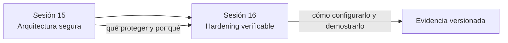
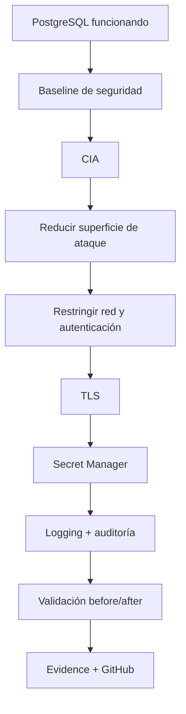
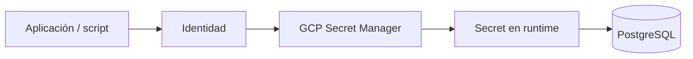
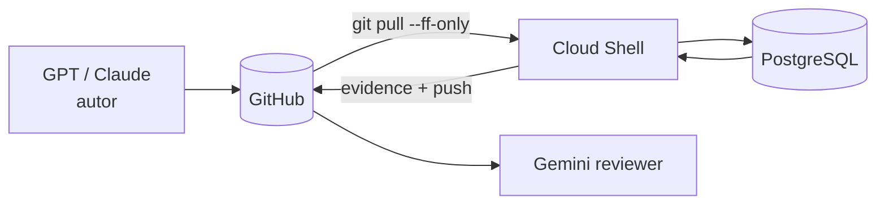

# DMC Institute — Informe de transición Sesión 15 → Sesión 16

## 1. Propósito

Este informe toma como baseline técnico y pedagógico lo trabajado en la Sesión 15 y define qué debe construirse en la Sesión 16.

La continuidad esperada es:



## 2. Baseline real de la Sesión 15

La Sesión 15 dejó cuatro capacidades prácticas:

1. SQL Injection reproducido y mitigado con query parametrizada.
2. Roles PostgreSQL separados y mínimo privilegio validado.
3. Backup + restore comprobado.
4. Diferencia entre réplica, backup y PITR documentada.

Además, el laboratorio estableció el ciclo DMC:

```text
Generate → Commit → Pull → Run → Validate → Evidence → Push → Review
```

GitHub funciona como fuente de verdad, Cloud Shell como ejecutor, Cloud SQL/PostgreSQL como entorno de validación y la evidencia como criterio de aceptación.

## 3. Qué NO debemos repetir en la Sesión 16

No repetir:

- teoría básica de SQL Injection;
- explicación de least privilege desde cero;
- diferencia entre réplica y backup;
- threat modeling básico;
- explicación de por qué no deben versionarse secretos.

La Sesión 16 debe usar esos conceptos como prerequisitos.

## 4. Brecha que debe cerrar la Sesión 16

La Sesión 15 respondió:

> ¿Qué debemos proteger y por qué?

La Sesión 16 debe responder:

> ¿Cómo dejamos PostgreSQL y su entorno endurecidos, cifrados, auditables y verificables?

La brecha se resume así:

| Tema | Sesión 15 | Sesión 16 |
|---|---|---|
| Riesgos | identificados | convertidos en controles |
| Privilegios | diseñados | auditados y endurecidos |
| Secrets | fuera del código | consumidos desde Secret Manager |
| Red | trust boundaries | listeners/accesos restringidos |
| Cifrado | concepto | TLS probado |
| Auditoría | necesidad | logging/auditoría configurados |
| Evidencia | before/after | baseline → hardened → validated |

## 5. Historia técnica de la Sesión 16

La narrativa debe continuar el mismo caso de Pedidos.



## 6. Contenido que debe desarrollarse

### 6.1 Modelo CIA aplicado al caso

- Confidentiality: roles, secretos, TLS, acceso.
- Integrity: privilegios, ownership, auditoría, constraints.
- Availability: backups, réplica, recuperación, observabilidad.

### 6.2 Baseline de hardening

Inventariar:

- puerto y listeners;
- `pg_hba.conf`;
- métodos de autenticación;
- usuarios, roles, ownership e inheritance;
- extensiones;
- parámetros de logging;
- estado de TLS;
- ubicación y manejo de secretos.

### 6.3 Hardening PostgreSQL/Linux

Validar y reducir:

```text
puertos
listeners
redes permitidas
roles administrativos
roles runtime
extensiones
servicios innecesarios
permisos
```

### 6.4 TLS

No basta con `ssl = on`.

La aceptación exige evidencia de sesión cifrada:

```sql
SELECT ssl, version, cipher
FROM pg_stat_ssl
WHERE pid = pg_backend_pid();
```

### 6.5 Secret Manager

Patrón esperado:



La credencial no debe aparecer en código, archivos versionados ni evidencia.

### 6.6 Auditoría y logs

El alumno debe poder responder con evidencia:

- quién se conectó;
- desde dónde;
- cuándo;
- con qué aplicación;
- qué falló;
- qué acciones relevantes quedaron registradas.

## 7. Laboratorio propuesto

La Sesión 16 debe reutilizar el mismo patrón operacional de la Sesión 15:



Bloques:

1. Baseline.
2. Hardening de listeners/accesos.
3. TLS.
4. Secret Manager.
5. Logging/auditoría.
6. Reviewer final.

## 8. Entregables esperados

```text
docs/security/
├── 07_cia_model.md
├── 08_postgresql_hardening.md
├── 09_tls_configuration.md
├── 10_secrets_management.md
├── 11_audit_logging.md
└── 12_zero_trust_notes.md

evidence/
├── hardening_before.txt
├── hardening_after.txt
├── tls_test.txt
├── secrets_test.txt
├── audit_test.txt
└── README.md
```

## 9. Gates de aceptación

No avanzar por ejecución exitosa. Avanzar por evidencia.

| Gate | PASS esperado |
|---|---|
| Baseline | inventario completo |
| Listener | acceso restringido según diseño |
| Roles | runtime sin superuser/owner |
| TLS | `pg_stat_ssl.ssl = true` |
| Secrets | secreto fuera del repo |
| Logs | conexión/actividad observable |
| Git | SHA ejecutado registrado |
| Review | Gemini READY o hallazgos documentados |

## 10. Definition of Done

- [ ] CIA mapeado a controles.
- [ ] baseline registrado.
- [ ] listeners y accesos revisados.
- [ ] roles e ownership auditados.
- [ ] extensiones inventariadas.
- [ ] TLS probado con evidencia.
- [ ] Secret Manager integrado o simulado con patrón verificable.
- [ ] logging/auditoría configurados.
- [ ] before/after versionado.
- [ ] evidence/README.md actualizado con SHA.
- [ ] reviewer final ejecutado.
- [ ] DMC Application Specification actualizada.

## 11. Idea fuerza

> En la Sesión 15 demostramos que un control reduce el riesgo. En la Sesión 16 demostramos que la configuración real de la plataforma aplica ese control.
