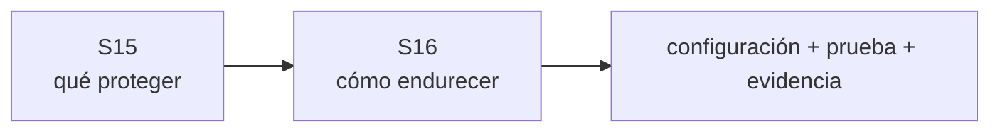

# DMC Institute — Sesión 16

## Hardening y protección de bases de datos

**Duración:** 3 horas  
**Modalidad:** teórico-práctica  
**Programa:** Arquitectura y Bases de Datos con IA para Aplicaciones Modernas  
**Metodología:** Spec-Driven Development + ATLAS + Evidence-Driven Validation

## Pregunta guía

> La arquitectura ya tiene controles. ¿Cómo demostramos que PostgreSQL está realmente endurecido, cifrado y auditable?

## Continuidad con la Sesión 15

La Sesión 15 dejó como baseline:

- SQL Injection mitigado y probado;
- mínimo privilegio validado;
- backup + restore comprobado;
- réplica diferenciada de backup;
- GitHub como fuente de verdad;
- Cloud Shell como estación de ejecución;
- evidencia versionada como criterio de aceptación.

La Sesión 16 no repite esas pruebas. Las lleva a configuración de plataforma.



## Contenido oficial

- Modelo CIA aplicado a bases de datos.
- Hardening: puertos, listeners, usuarios, logs y extensiones.
- Cifrado at-rest e in-transit.
- Introducción a Zero Trust.
- Taller: hardening de PostgreSQL en Linux.
- Taller: configuración TLS.
- Taller: implementación de secrets manager.
- Taller: auditoría y logs.

## Resultado observable

Cada equipo termina con:

- baseline de seguridad;
- matriz CIA → controles;
- listeners y acceso revisados;
- roles/ownership/extensiones auditados;
- conexión TLS verificada;
- secreto fuera del repositorio;
- logging/auditoría demostrados;
- evidencia before/after;
- actualización del Spec.

## Ciclo de trabajo

```text
Generate → Commit → Pull → Run → Validate → Evidence → Push → Review
```

## Material de la sesión

- [Plan docente de 3 horas](./01_plan_docente_3_horas.md)
- [Informe de transición Sesión 15 → 16](./02_informe_transicion_s15_s16.md)
- [Laboratorio guiado](./laboratorio/README.md)

## Idea fuerza

> Hardening no es agregar herramientas. Es reducir superficie de ataque, eliminar confianza innecesaria y demostrar que los controles funcionan.
