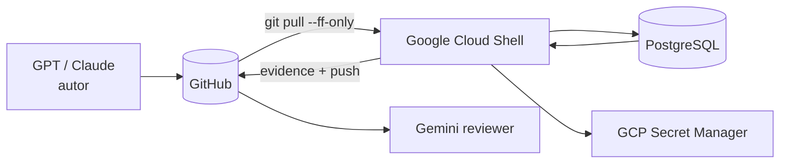
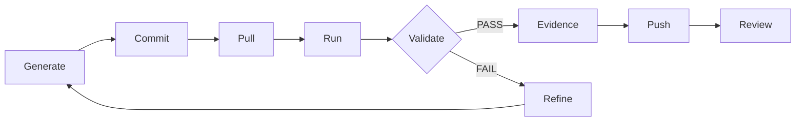
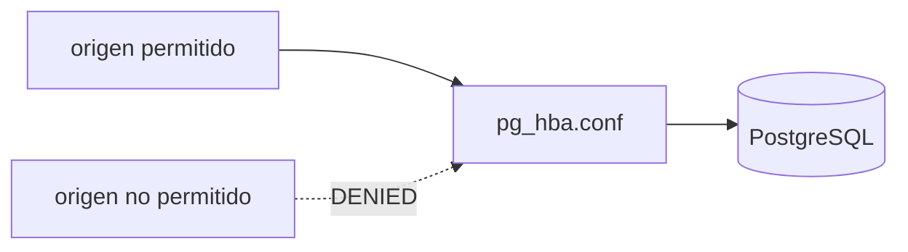
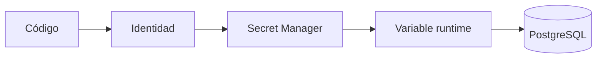

# DMC Institute — Sesión 16

# Laboratorio guiado — Hardening PostgreSQL con evidencia

## Objetivo

Partir del aprendizaje de la Sesión 15 y convertirlo en configuración verificable.

La regla del laboratorio es:

> No se acepta “está configurado”. Se acepta “está probado y existe evidencia versionada”.

## Arquitectura



## Ciclo DMC



## Estructura esperada

```text
docs/security/
├── 07_cia_model.md
├── 08_postgresql_hardening.md
├── 09_tls_configuration.md
├── 10_secrets_management.md
├── 11_audit_logging.md
└── 12_zero_trust_notes.md

evidence/
├── hardening_before.txt
├── hardening_after.txt
├── tls_test.txt
├── secrets_test.txt
├── audit_test.txt
└── README.md
```

## Bloque 0 — Sincronización y baseline

Antes de ejecutar:

```bash
git status --short
git branch --show-current
git pull --ff-only
git log -1 --oneline
```

Crear evidencia baseline:

```bash
{
  echo "# HARDENING BEFORE"
  date -u
  git rev-parse HEAD
  ss -lntp || true
} | tee evidence/hardening_before.txt
```

En PostgreSQL:

```sql
SHOW listen_addresses;
SHOW port;
SHOW ssl;
SHOW password_encryption;

SELECT rolname, rolsuper, rolcreaterole, rolcreatedb
FROM pg_roles;

SELECT extname, extversion
FROM pg_extension;
```

### Checkpoint 0

| Validación | Esperado |
|---|---|
| SHA identificado | sí |
| listener conocido | sí |
| estado SSL conocido | sí |
| roles administrativos inventariados | sí |
| extensiones inventariadas | sí |

## Bloque 1 — Hardening de red y autenticación

Objetivo: reducir exposición.

Revisar:

- `listen_addresses`;
- puerto;
- redes permitidas;
- reglas de `pg_hba.conf`;
- método de autenticación;
- accesos innecesarios.

Modelo:



Guardar en `docs/security/08_postgresql_hardening.md`:

- before;
- cambio;
- justificación;
- riesgo reducido;
- validación.

## Bloque 2 — Roles, ownership e inheritance

Validar:

```sql
SELECT rolname, rolsuper, rolcreaterole, rolcreatedb, rolinherit
FROM pg_roles;

SELECT tablename, tableowner
FROM pg_tables
WHERE schemaname='public';
```

Checkpoint:

- runtime no superuser;
- runtime no owner;
- runtime sin CREATEROLE;
- runtime sin CREATEDB;
- privilegios heredados explicados.

## Bloque 3 — TLS

Objetivo: demostrar canal cifrado.

Después de configurar el entorno de laboratorio:

```sql
SELECT ssl, version, cipher
FROM pg_stat_ssl
WHERE pid = pg_backend_pid();
```

Evidencia:

```text
ssl = true
version = TLS...
cipher = ...
```

Guardar:

```text
docs/security/09_tls_configuration.md
evidence/tls_test.txt
```

## Bloque 4 — Secret Manager

En GCP:

1. crear un secreto de laboratorio;
2. conceder acceso solo a la identidad autorizada;
3. leerlo en runtime;
4. comprobar que no está versionado.

Patrón:



Validación del repo:

```bash
git grep -i "password" || true
git grep -i "secret" || true
git status --short
```

No copiar el valor del secreto a evidence.

Guardar solo:

- nombre lógico;
- identidad;
- política;
- resultado PASS/FAIL.

## Bloque 5 — Logging y auditoría

Revisar configuración de logging y observar conexiones.

```sql
SELECT usename, application_name, client_addr, backend_start
FROM pg_stat_activity;
```

Pruebas controladas:

1. conexión válida;
2. conexión fallida;
3. operación permitida;
4. operación bloqueada por permisos.

La evidencia debe demostrar qué eventos son observables.

## Bloque 6 — Evidence Index

`evidence/README.md`:

```markdown
# Session 16 Evidence

## Commit ejecutado
<SHA>

## Checkpoints

| Gate | Resultado |
|---|---|
| Baseline | PASS |
| Listener / acceso | PASS |
| Roles / ownership | PASS |
| TLS | PASS |
| Secret Manager | PASS |
| Audit / Logs | PASS |
| Reviewer | PASS |

## Estado
READY
```

## Reviewer obligatorio

Prompt Gemini:

```text
## ACTOR
Arquitecto de seguridad PostgreSQL.

## TAREA
Revisa docs/security y evidence de la Sesión 16.

## LÍMITES
No inventes controles.
No copies secretos.
Cada control implementado debe señalar evidencia.
Diferencia configuración observada de recomendación.

## AUTOVALIDACIÓN
Revisa CIA, red, roles, ownership, TLS, secretos, extensiones y auditoría.

## SALIDA
Hallazgos + evidencia + riesgo residual + READY / NOT READY.
```

## Definition of Done

- [ ] SHA ejecutado registrado;
- [ ] baseline PASS;
- [ ] red/listeners PASS;
- [ ] roles/ownership PASS;
- [ ] TLS PASS;
- [ ] Secret Manager PASS;
- [ ] audit/logs PASS;
- [ ] reviewer realizado;
- [ ] docs y evidence versionados;
- [ ] working tree clean.

## Cierre

> En la Sesión 15 reducimos el riesgo desde el diseño. En la Sesión 16 demostramos que la configuración real aplica ese diseño.
